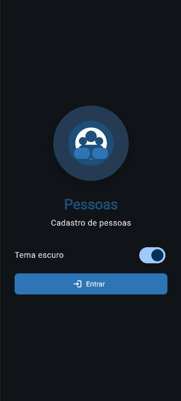
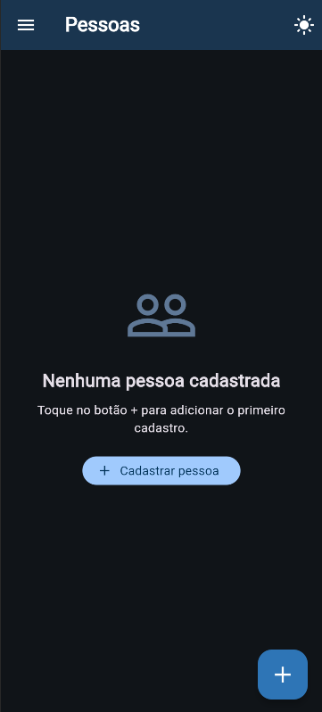
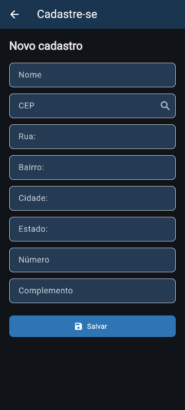

# Desafio 01 — Pessoas

Aplicativo Flutter desenvolvido para o Desafio 01.

## Tecnologias

- Flutter
- Dart
- API ViaCEP
- VS Code

## Funcionalidades

- Tela Splash com animação e botão de entrada.
- Cadastro de pessoas.
- Consulta de endereço pela API ViaCEP através do CEP.
- Preenchimento automático de rua, bairro, cidade e estado.
- Listagem dos cadastros.
- Edição e exclusão de pessoas.
- Persistência local dos dados.
- Menu lateral com acesso à Splash.
- Alternância entre tema claro e escuro.

## Passos para testar

1. Clone este repositório.
2. Abra o projeto no VS Code.
3. Execute o comando `flutter pub get`.
4. Execute o comando `flutter run`.

## Telas

### Print 1



### Print 2



### Print 3



## Como executar

Dentro da pasta do projeto:

```bash
flutter pub get
flutter run
```

## APK

[Baixar APK](assets/app-release.apk)
"# desafio1_pessoas" 
